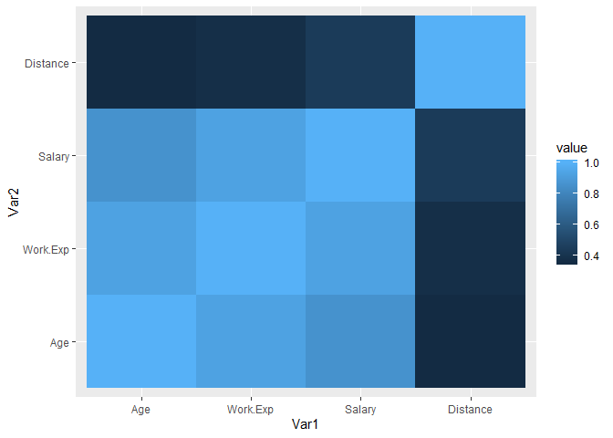
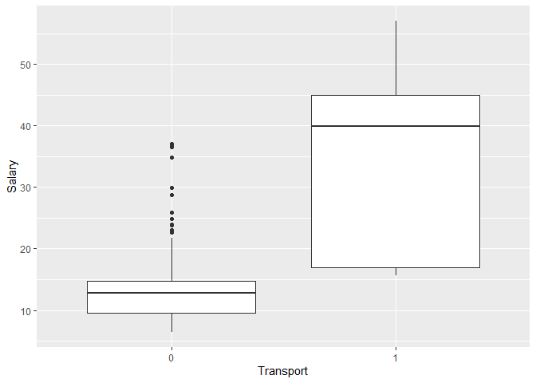
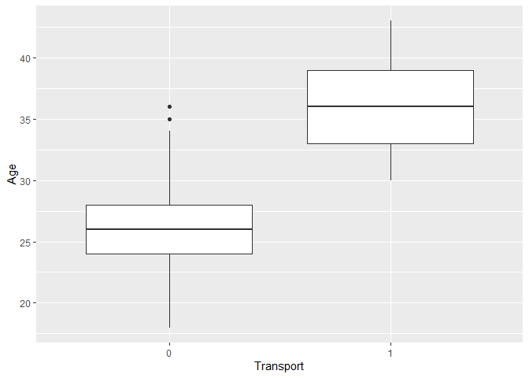

Multiple Classification Techniques
================
Sheetanshu
8/3/2020

``` r
getwd()
```

    ## [1] "C:/Users/Admin/Desktop/Stats/Markdown 2/Projects/Classification using multiple models"

``` r
data.cars = read.csv("Cars.csv", header = TRUE)

View(data.cars)
```

\#\#\#\#\#\#\#\#\#\#\#\#\#\#\#\#\#\#\#\#\#\#Exploratory data analysis
and data preparation

``` r
############checking complete cases

sum(complete.cases(data.cars))
```

    ## [1] 443

``` r
colSums(is.na(data.cars))
```

    ##       Age    Gender  Engineer       MBA  Work.Exp    Salary  Distance   license 
    ##         0         0         0         1         0         0         0         0 
    ## Transport 
    ##         0

\#\#\#\#\#\#\#\#\#The data set has one incomplete case

``` r
############taking complete cases for analysis

data.cars2 = data.cars[complete.cases(data.cars), ]
```

``` r
#########converting categorical variables into factors

data.cars2$Engineer = as.factor(data.cars2$Engineer)
data.cars2$MBA = as.factor(data.cars2$MBA)
data.cars2$license = as.factor(data.cars2$license)
```

``` r
########checking whether the target variable(Transport) is balanced or not 

prop.table(table(data.cars2$Transport))
```

    ## 
    ##         2Wheeler              Car Public Transport 
    ##        0.1873589        0.1376975        0.6749436

\#\#\#\#\#\#\#\#\#\#\#\#\#The category cars make up 13.7% of the data
while other transport make up the remaining. Since we are interested in
only two categories - “Car” and “Non-Car” Balancing the target variable
is not required as both of these categories are over 10%

``` r
data.cars2$Transport = as.character(data.cars2$Transport)

data.cars2$Transport[data.cars2$Transport=="Public Transport"] = "0"
data.cars2$Transport[data.cars2$Transport=="2Wheeler"] = "0"
data.cars2$Transport[data.cars2$Transport=="Car"] = "1"


data.cars2$Transport = as.factor(data.cars2$Transport)
```

``` r
cor(data.cars2[, c(1, 5, 6, 7)])
```

    ##                Age  Work.Exp    Salary  Distance
    ## Age      1.0000000 0.9322510 0.8607652 0.3530563
    ## Work.Exp 0.9322510 1.0000000 0.9320081 0.3727857
    ## Salary   0.8607652 0.9320081 1.0000000 0.4422379
    ## Distance 0.3530563 0.3727857 0.4422379 1.0000000

``` r
library(reshape2)
library(ggplot2)
qplot(x = Var1, y = Var2,
      data = melt(cor(data.cars2[, c(1, 5, 6, 7)])),
      fill = value,
      geom = "tile")
```

<!-- -->

``` r
View(data.cars2)

ggplot(data.cars2, aes(x = Transport, y = Salary)) +geom_boxplot()
```

<!-- -->

``` r
ggplot(data.cars2, aes(x = Transport, y = Age)) +geom_boxplot()
```

<!-- -->

``` r
library(caret)
```

    ## Loading required package: lattice

``` r
?createDataPartition
```

    ## starting httpd help server ...

    ##  done

``` r
part = createDataPartition(data.cars2$Transport, p = 0.7, list = FALSE)

train.cars3 = data.cars2[part, ]
test.cars3 = data.cars2[-part, ]
```

``` r
##############Creating duplicate train and test sets - one for each model

train.cars4 = train.cars3
train.cars5 = train.cars3
train.cars6 = train.cars3
train.cars7 = train.cars3

test.cars4 = test.cars3
test.cars5 = test.cars3
test.cars6 = test.cars3
test.cars7 = test.cars3
```

``` r
##############fitting logistic regression model

logit = glm(Transport~., data = train.cars3, family=binomial)
```

    ## Warning: glm.fit: fitted probabilities numerically 0 or 1 occurred

``` r
logit
```

    ## 
    ## Call:  glm(formula = Transport ~ ., family = binomial, data = train.cars3)
    ## 
    ## Coefficients:
    ## (Intercept)          Age   GenderMale    Engineer1         MBA1     Work.Exp  
    ##  -90.537401     2.889436    -2.519254     0.009859    -2.423231    -1.666843  
    ##      Salary     Distance     license1  
    ##    0.306556     0.710596     3.662337  
    ## 
    ## Degrees of Freedom: 310 Total (i.e. Null);  302 Residual
    ## Null Deviance:       249.9 
    ## Residual Deviance: 37.59     AIC: 55.59

``` r
##checking overall validity of the model

library(lmtest)
```

    ## Warning: package 'lmtest' was built under R version 3.6.2

    ## Loading required package: zoo

    ## 
    ## Attaching package: 'zoo'

    ## The following objects are masked from 'package:base':
    ## 
    ##     as.Date, as.Date.numeric

``` r
lrtest(logit)
```

    ## Likelihood ratio test
    ## 
    ## Model 1: Transport ~ Age + Gender + Engineer + MBA + Work.Exp + Salary + 
    ##     Distance + license
    ## Model 2: Transport ~ 1
    ##   #Df   LogLik Df  Chisq Pr(>Chisq)    
    ## 1   9  -18.794                         
    ## 2   1 -124.959 -8 212.33  < 2.2e-16 ***
    ## ---
    ## Signif. codes:  0 '***' 0.001 '**' 0.01 '*' 0.05 '.' 0.1 ' ' 1

``` r
summary(logit)
```

    ## 
    ## Call:
    ## glm(formula = Transport ~ ., family = binomial, data = train.cars3)
    ## 
    ## Deviance Residuals: 
    ##      Min        1Q    Median        3Q       Max  
    ## -2.13394  -0.01599  -0.00156  -0.00005   1.87419  
    ## 
    ## Coefficients:
    ##               Estimate Std. Error z value Pr(>|z|)    
    ## (Intercept) -90.537401  24.976456  -3.625 0.000289 ***
    ## Age           2.889436   0.823250   3.510 0.000448 ***
    ## GenderMale   -2.519254   1.182073  -2.131 0.033071 *  
    ## Engineer1     0.009859   1.156160   0.009 0.993196    
    ## MBA1         -2.423231   1.244689  -1.947 0.051552 .  
    ## Work.Exp     -1.666843   0.533431  -3.125 0.001779 ** 
    ## Salary        0.306556   0.111380   2.752 0.005917 ** 
    ## Distance      0.710596   0.224548   3.165 0.001553 ** 
    ## license1      3.662337   1.284074   2.852 0.004343 ** 
    ## ---
    ## Signif. codes:  0 '***' 0.001 '**' 0.01 '*' 0.05 '.' 0.1 ' ' 1
    ## 
    ## (Dispersion parameter for binomial family taken to be 1)
    ## 
    ##     Null deviance: 249.919  on 310  degrees of freedom
    ## Residual deviance:  37.588  on 302  degrees of freedom
    ## AIC: 55.588
    ## 
    ## Number of Fisher Scoring iterations: 10

``` r
library(car)
```

    ## Loading required package: carData

``` r
vif(logit)
```

    ##       Age    Gender  Engineer       MBA  Work.Exp    Salary  Distance   license 
    ## 17.683696  1.961946  1.136944  1.589722 23.183710  4.917849  2.518027  2.378657

``` r
##########removing variables with p value > o.05

train.cars31 = train.cars3[, -c(3, 4)]

View(train.cars31)
```

``` r
##########fitting the model

logit = glm(Transport~., data = train.cars31, family=binomial)

summary(logit)
```

    ## 
    ## Call:
    ## glm(formula = Transport ~ ., family = binomial, data = train.cars31)
    ## 
    ## Deviance Residuals: 
    ##      Min        1Q    Median        3Q       Max  
    ## -2.38392  -0.02631  -0.00358  -0.00022   1.88628  
    ## 
    ## Coefficients:
    ##              Estimate Std. Error z value Pr(>|z|)    
    ## (Intercept) -79.95800   20.57959  -3.885 0.000102 ***
    ## Age           2.56994    0.68488   3.752 0.000175 ***
    ## GenderMale   -2.75921    1.17498  -2.348 0.018859 *  
    ## Work.Exp     -1.54986    0.46463  -3.336 0.000851 ***
    ## Salary        0.27162    0.09726   2.793 0.005226 ** 
    ## Distance      0.62604    0.19767   3.167 0.001540 ** 
    ## license1      3.28526    1.13979   2.882 0.003947 ** 
    ## ---
    ## Signif. codes:  0 '***' 0.001 '**' 0.01 '*' 0.05 '.' 0.1 ' ' 1
    ## 
    ## (Dispersion parameter for binomial family taken to be 1)
    ## 
    ##     Null deviance: 249.919  on 310  degrees of freedom
    ## Residual deviance:  42.055  on 304  degrees of freedom
    ## AIC: 56.055
    ## 
    ## Number of Fisher Scoring iterations: 10

``` r
##########checking vif of remaining variables

vif(logit)
```

    ##       Age    Gender  Work.Exp    Salary  Distance   license 
    ## 15.522711  2.088245 20.881624  4.389356  2.078221  2.110182

``` r
##########removing multi collinear variables

View(train.cars31)

train.cars32 = train.cars31[, -c(1, 2, 3)]

View(train.cars32)
```

``` r
##########fitting the model again

logit = glm(Transport~., data = train.cars32, family=binomial)

summary(logit)
```

    ## 
    ## Call:
    ## glm(formula = Transport ~ ., family = binomial, data = train.cars32)
    ## 
    ## Deviance Residuals: 
    ##      Min        1Q    Median        3Q       Max  
    ## -1.88977  -0.25623  -0.14257  -0.07604   2.92966  
    ## 
    ## Coefficients:
    ##             Estimate Std. Error z value Pr(>|z|)    
    ## (Intercept) -10.0427     1.6231  -6.187 6.12e-10 ***
    ## Salary        0.1610     0.0309   5.211 1.87e-07 ***
    ## Distance      0.3344     0.1045   3.200  0.00137 ** 
    ## license1      2.2241     0.5915   3.760  0.00017 ***
    ## ---
    ## Signif. codes:  0 '***' 0.001 '**' 0.01 '*' 0.05 '.' 0.1 ' ' 1
    ## 
    ## (Dispersion parameter for binomial family taken to be 1)
    ## 
    ##     Null deviance: 249.92  on 310  degrees of freedom
    ## Residual deviance:  91.48  on 307  degrees of freedom
    ## AIC: 99.48
    ## 
    ## Number of Fisher Scoring iterations: 7

``` r
##########finally checking vif

vif(logit)
```

    ##   Salary Distance  license 
    ## 1.003519 1.065692 1.065319

``` r
##checking pseudo R square

library(pscl)
```

    ## Warning: package 'pscl' was built under R version 3.6.2

    ## Classes and Methods for R developed in the
    ## Political Science Computational Laboratory
    ## Department of Political Science
    ## Stanford University
    ## Simon Jackman
    ## hurdle and zeroinfl functions by Achim Zeileis

``` r
pR2(logit)
```

    ##          llh      llhNull           G2     McFadden         r2ML         r2CU 
    ##  -45.7400235 -124.9594799  158.4389128    0.6339612    0.3991740    0.7227684

``` r
###########preparing the test dataset

View(test.cars3)

test.cars32 = test.cars3[, -c(1, 2, 3, 4, 5)]

View(test.cars32)
```

``` r
##predicting the train and test data set

predicted.logit = predict(logit, train.cars32, type = "response")

predicted.logit = floor(predicted.logit+0.5)

predicted.logitest = predict(logit, test.cars32, type = "response")

predicted.logitest = floor(predicted.logitest+0.5)
```

``` r
##############preparing confusion matrix

predicted.logit = as.factor(predicted.logit)

predicted.logitest = as.factor(predicted.logitest)


confusionMatrix(predicted.logit, train.cars32$Transport, positive = "1")
```

    ## Confusion Matrix and Statistics
    ## 
    ##           Reference
    ## Prediction   0   1
    ##          0 264  13
    ##          1   4  30
    ##                                           
    ##                Accuracy : 0.9453          
    ##                  95% CI : (0.9139, 0.9678)
    ##     No Information Rate : 0.8617          
    ##     P-Value [Acc > NIR] : 1.623e-06       
    ##                                           
    ##                   Kappa : 0.7485          
    ##                                           
    ##  Mcnemar's Test P-Value : 0.05235         
    ##                                           
    ##             Sensitivity : 0.69767         
    ##             Specificity : 0.98507         
    ##          Pos Pred Value : 0.88235         
    ##          Neg Pred Value : 0.95307         
    ##              Prevalence : 0.13826         
    ##          Detection Rate : 0.09646         
    ##    Detection Prevalence : 0.10932         
    ##       Balanced Accuracy : 0.84137         
    ##                                           
    ##        'Positive' Class : 1               
    ## 

``` r
confusionMatrix(predicted.logitest, test.cars32$Transport, positive = "1")
```

    ## Confusion Matrix and Statistics
    ## 
    ##           Reference
    ## Prediction   0   1
    ##          0 110   3
    ##          1   4  15
    ##                                           
    ##                Accuracy : 0.947           
    ##                  95% CI : (0.8938, 0.9784)
    ##     No Information Rate : 0.8636          
    ##     P-Value [Acc > NIR] : 0.001692        
    ##                                           
    ##                   Kappa : 0.78            
    ##                                           
    ##  Mcnemar's Test P-Value : 1.000000        
    ##                                           
    ##             Sensitivity : 0.8333          
    ##             Specificity : 0.9649          
    ##          Pos Pred Value : 0.7895          
    ##          Neg Pred Value : 0.9735          
    ##              Prevalence : 0.1364          
    ##          Detection Rate : 0.1136          
    ##    Detection Prevalence : 0.1439          
    ##       Balanced Accuracy : 0.8991          
    ##                                           
    ##        'Positive' Class : 1               
    ## 

\#\#\#\#\#\#\#\#\#\#\#\#\#\#\#\#\#\#\#\#\#\#\#\#\#Model 2 - Naive Bayes

``` r
library(e1071)
```

    ## Warning: package 'e1071' was built under R version 3.6.2

``` r
nb=naiveBayes(Transport~., data=train.cars4)

nb
```

    ## 
    ## Naive Bayes Classifier for Discrete Predictors
    ## 
    ## Call:
    ## naiveBayes.default(x = X, y = Y, laplace = laplace)
    ## 
    ## A-priori probabilities:
    ## Y
    ##         0         1 
    ## 0.8617363 0.1382637 
    ## 
    ## Conditional probabilities:
    ##    Age
    ## Y       [,1]     [,2]
    ##   0 26.33209 3.080350
    ##   1 35.06977 3.355134
    ## 
    ##    Gender
    ## Y      Female      Male
    ##   0 0.3022388 0.6977612
    ##   1 0.2790698 0.7209302
    ## 
    ##    Engineer
    ## Y            0          1
    ##   0 0.26119403 0.73880597
    ##   1 0.09302326 0.90697674
    ## 
    ##    MBA
    ## Y           0         1
    ##   0 0.7313433 0.2686567
    ##   1 0.7674419 0.2325581
    ## 
    ##    Work.Exp
    ## Y        [,1]     [,2]
    ##   0  4.753731 3.243978
    ##   1 14.837209 4.903498
    ## 
    ##    Salary
    ## Y       [,1]      [,2]
    ##   0 12.98396  5.078036
    ##   1 34.21163 12.750205
    ## 
    ##    Distance
    ## Y       [,1]     [,2]
    ##   0 10.55075 3.031909
    ##   1 15.11395 3.554915
    ## 
    ##    license
    ## Y           0         1
    ##   0 0.8768657 0.1231343
    ##   1 0.2325581 0.7674419

``` r
## Predicting the training and test data

nb_train_pred = predict(nb,train.cars4)

nb_test_pred = predict(nb,test.cars4)
```

``` r
### Confusion matrix on the train data

confusionMatrix(nb_train_pred,train.cars4$Transport, positive = "1")
```

    ## Confusion Matrix and Statistics
    ## 
    ##           Reference
    ## Prediction   0   1
    ##          0 259   9
    ##          1   9  34
    ##                                           
    ##                Accuracy : 0.9421          
    ##                  95% CI : (0.9101, 0.9653)
    ##     No Information Rate : 0.8617          
    ##     P-Value [Acc > NIR] : 4.396e-06       
    ##                                           
    ##                   Kappa : 0.7571          
    ##                                           
    ##  Mcnemar's Test P-Value : 1               
    ##                                           
    ##             Sensitivity : 0.7907          
    ##             Specificity : 0.9664          
    ##          Pos Pred Value : 0.7907          
    ##          Neg Pred Value : 0.9664          
    ##              Prevalence : 0.1383          
    ##          Detection Rate : 0.1093          
    ##    Detection Prevalence : 0.1383          
    ##       Balanced Accuracy : 0.8786          
    ##                                           
    ##        'Positive' Class : 1               
    ## 

``` r
### Confusion matrix on the test data

confusionMatrix(nb_test_pred,test.cars4$Transport, positive = "1")
```

    ## Confusion Matrix and Statistics
    ## 
    ##           Reference
    ## Prediction   0   1
    ##          0 111   2
    ##          1   3  16
    ##                                           
    ##                Accuracy : 0.9621          
    ##                  95% CI : (0.9138, 0.9876)
    ##     No Information Rate : 0.8636          
    ##     P-Value [Acc > NIR] : 0.000156        
    ##                                           
    ##                   Kappa : 0.8429          
    ##                                           
    ##  Mcnemar's Test P-Value : 1.000000        
    ##                                           
    ##             Sensitivity : 0.8889          
    ##             Specificity : 0.9737          
    ##          Pos Pred Value : 0.8421          
    ##          Neg Pred Value : 0.9823          
    ##              Prevalence : 0.1364          
    ##          Detection Rate : 0.1212          
    ##    Detection Prevalence : 0.1439          
    ##       Balanced Accuracy : 0.9313          
    ##                                           
    ##        'Positive' Class : 1               
    ## 

\#\#\#\#\#\#\#\#\#\#\#\#\#\#\#\#\#\#\#\#\#\#\#\#\#Model 3 - KNN

``` r
train.cars4[, c(1, 5, 6, 7)] = scale(train.cars4[, c(1, 5, 6, 7)])

test.cars4[, c(1, 5, 6, 7)] = scale(test.cars4[, c(1, 5, 6, 7)])
```

``` r
train.cars4$Gender = as.character(train.cars4$Gender)

train.cars4$Gender[train.cars4$Gender=="Male"]  = 1

train.cars4$Gender[train.cars4$Gender=="Female"]  = 0

test.cars4$Gender = as.character(test.cars4$Gender)

test.cars4$Gender[test.cars4$Gender=="Male"]  = 1

test.cars4$Gender[test.cars4$Gender=="Female"]  = 0
```

``` r
?knn

library(DMwR)
```

    ## Warning: package 'DMwR' was built under R version 3.6.3

    ## Loading required package: grid

    ## Registered S3 method overwritten by 'xts':
    ##   method     from
    ##   as.zoo.xts zoo

    ## Registered S3 method overwritten by 'quantmod':
    ##   method            from
    ##   as.zoo.data.frame zoo

``` r
KNN = kNN(Transport~., train.cars4, test.cars4[, -9], norm = FALSE, k = 4)

KNN2 = kNN(Transport~., train.cars4, train.cars4[, -9], norm = FALSE, k = 4)
```

``` r
##############confusion matrix 

confusionMatrix(KNN, test.cars4$Transport, positive = "1")
```

    ## Confusion Matrix and Statistics
    ## 
    ##           Reference
    ## Prediction   0   1
    ##          0 112   4
    ##          1   2  14
    ##                                           
    ##                Accuracy : 0.9545          
    ##                  95% CI : (0.9037, 0.9831)
    ##     No Information Rate : 0.8636          
    ##     P-Value [Acc > NIR] : 0.0005559       
    ##                                           
    ##                   Kappa : 0.7975          
    ##                                           
    ##  Mcnemar's Test P-Value : 0.6830914       
    ##                                           
    ##             Sensitivity : 0.7778          
    ##             Specificity : 0.9825          
    ##          Pos Pred Value : 0.8750          
    ##          Neg Pred Value : 0.9655          
    ##              Prevalence : 0.1364          
    ##          Detection Rate : 0.1061          
    ##    Detection Prevalence : 0.1212          
    ##       Balanced Accuracy : 0.8801          
    ##                                           
    ##        'Positive' Class : 1               
    ## 

``` r
##############confusion matrix train

confusionMatrix(KNN2, train.cars4$Transport, positive = "1")
```

    ## Confusion Matrix and Statistics
    ## 
    ##           Reference
    ## Prediction   0   1
    ##          0 264   7
    ##          1   4  36
    ##                                           
    ##                Accuracy : 0.9646          
    ##                  95% CI : (0.9376, 0.9822)
    ##     No Information Rate : 0.8617          
    ##     P-Value [Acc > NIR] : 1.025e-09       
    ##                                           
    ##                   Kappa : 0.8471          
    ##                                           
    ##  Mcnemar's Test P-Value : 0.5465          
    ##                                           
    ##             Sensitivity : 0.8372          
    ##             Specificity : 0.9851          
    ##          Pos Pred Value : 0.9000          
    ##          Neg Pred Value : 0.9742          
    ##              Prevalence : 0.1383          
    ##          Detection Rate : 0.1158          
    ##    Detection Prevalence : 0.1286          
    ##       Balanced Accuracy : 0.9111          
    ##                                           
    ##        'Positive' Class : 1               
    ## 

\#\#\#\#\#\#\#\#\#\#\#\#\#\#\#\#\#\#\#\#\#\#\#\#\#Model 3 - Baggging

``` r
library(caret) 

?trainControl

train.c = trainControl(method = "repeatedcv", number = 3)
               
modelrf = train(Transport ~., data = train.cars5, method = "rf", 
              trControl = train.c, tuneLength = 5)
```

``` r
predrf1 = predict(modelrf, train.cars5)
predrf2 = predict(modelrf, test.cars5)
```

``` r
##############confusion matrix train

confusionMatrix(predrf1, train.cars5$Transport, positive = "1")
```

    ## Confusion Matrix and Statistics
    ## 
    ##           Reference
    ## Prediction   0   1
    ##          0 268   0
    ##          1   0  43
    ##                                      
    ##                Accuracy : 1          
    ##                  95% CI : (0.9882, 1)
    ##     No Information Rate : 0.8617     
    ##     P-Value [Acc > NIR] : < 2.2e-16  
    ##                                      
    ##                   Kappa : 1          
    ##                                      
    ##  Mcnemar's Test P-Value : NA         
    ##                                      
    ##             Sensitivity : 1.0000     
    ##             Specificity : 1.0000     
    ##          Pos Pred Value : 1.0000     
    ##          Neg Pred Value : 1.0000     
    ##              Prevalence : 0.1383     
    ##          Detection Rate : 0.1383     
    ##    Detection Prevalence : 0.1383     
    ##       Balanced Accuracy : 1.0000     
    ##                                      
    ##        'Positive' Class : 1          
    ## 

``` r
##############confusion matrix test

confusionMatrix(predrf2, test.cars5$Transport, positive = "1")
```

    ## Confusion Matrix and Statistics
    ## 
    ##           Reference
    ## Prediction   0   1
    ##          0 110   1
    ##          1   4  17
    ##                                           
    ##                Accuracy : 0.9621          
    ##                  95% CI : (0.9138, 0.9876)
    ##     No Information Rate : 0.8636          
    ##     P-Value [Acc > NIR] : 0.000156        
    ##                                           
    ##                   Kappa : 0.8497          
    ##                                           
    ##  Mcnemar's Test P-Value : 0.371093        
    ##                                           
    ##             Sensitivity : 0.9444          
    ##             Specificity : 0.9649          
    ##          Pos Pred Value : 0.8095          
    ##          Neg Pred Value : 0.9910          
    ##              Prevalence : 0.1364          
    ##          Detection Rate : 0.1288          
    ##    Detection Prevalence : 0.1591          
    ##       Balanced Accuracy : 0.9547          
    ##                                           
    ##        'Positive' Class : 1               
    ## 

\#\#\#\#\#\#\#\#\#\#\#\#\#\#\#\#\#\#\#\#\#\#\#\#\#Model 4 - Boosting

``` r
train.x = trainControl(method = "repeatedcv", number = 3)


model.x = train(Transport ~., data = train.cars6, method = "xgbTree", 
              trControl = train.x, tuneLength = 5)
```

``` r
predrx1 = predict(model.x, train.cars6)
predrx2 = predict(model.x, test.cars6)
```

``` r
##################confusion matrix

confusionMatrix(predrx1, train.cars6$Transport, positive = "1")
```

    ## Confusion Matrix and Statistics
    ## 
    ##           Reference
    ## Prediction   0   1
    ##          0 268   1
    ##          1   0  42
    ##                                           
    ##                Accuracy : 0.9968          
    ##                  95% CI : (0.9822, 0.9999)
    ##     No Information Rate : 0.8617          
    ##     P-Value [Acc > NIR] : <2e-16          
    ##                                           
    ##                   Kappa : 0.9864          
    ##                                           
    ##  Mcnemar's Test P-Value : 1               
    ##                                           
    ##             Sensitivity : 0.9767          
    ##             Specificity : 1.0000          
    ##          Pos Pred Value : 1.0000          
    ##          Neg Pred Value : 0.9963          
    ##              Prevalence : 0.1383          
    ##          Detection Rate : 0.1350          
    ##    Detection Prevalence : 0.1350          
    ##       Balanced Accuracy : 0.9884          
    ##                                           
    ##        'Positive' Class : 1               
    ## 

``` r
##################confusion matrix

confusionMatrix(predrx2, test.cars6$Transport, positive = "1")
```

    ## Confusion Matrix and Statistics
    ## 
    ##           Reference
    ## Prediction   0   1
    ##          0 110   0
    ##          1   4  18
    ##                                           
    ##                Accuracy : 0.9697          
    ##                  95% CI : (0.9242, 0.9917)
    ##     No Information Rate : 0.8636          
    ##     P-Value [Acc > NIR] : 3.635e-05       
    ##                                           
    ##                   Kappa : 0.8824          
    ##                                           
    ##  Mcnemar's Test P-Value : 0.1336          
    ##                                           
    ##             Sensitivity : 1.0000          
    ##             Specificity : 0.9649          
    ##          Pos Pred Value : 0.8182          
    ##          Neg Pred Value : 1.0000          
    ##              Prevalence : 0.1364          
    ##          Detection Rate : 0.1364          
    ##    Detection Prevalence : 0.1667          
    ##       Balanced Accuracy : 0.9825          
    ##                                           
    ##        'Positive' Class : 1               
    ##
